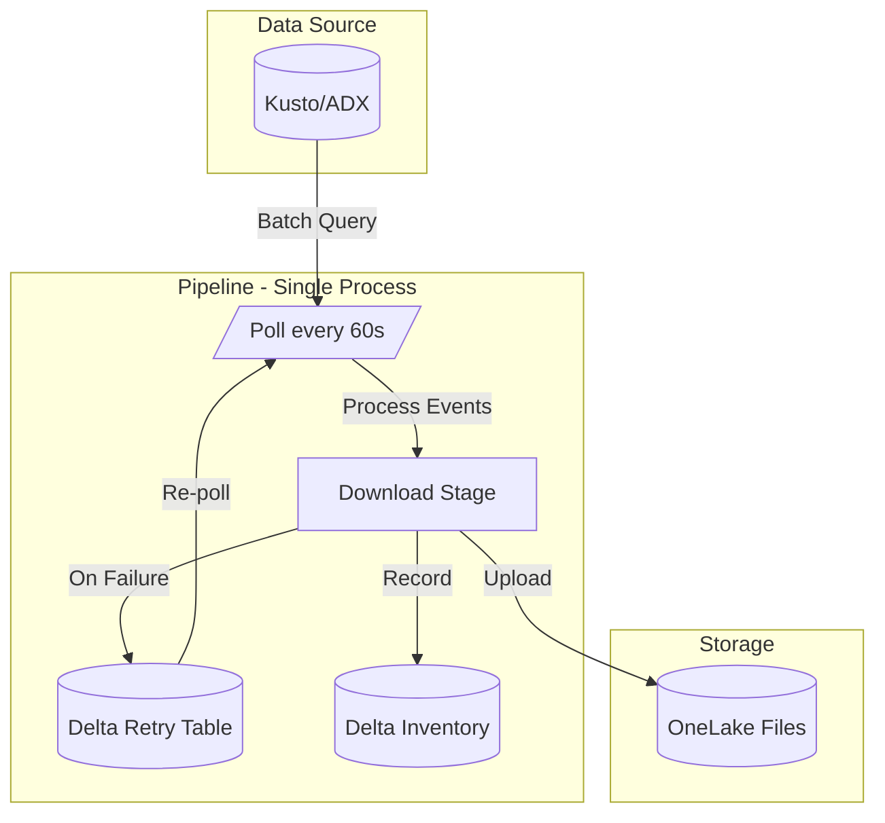
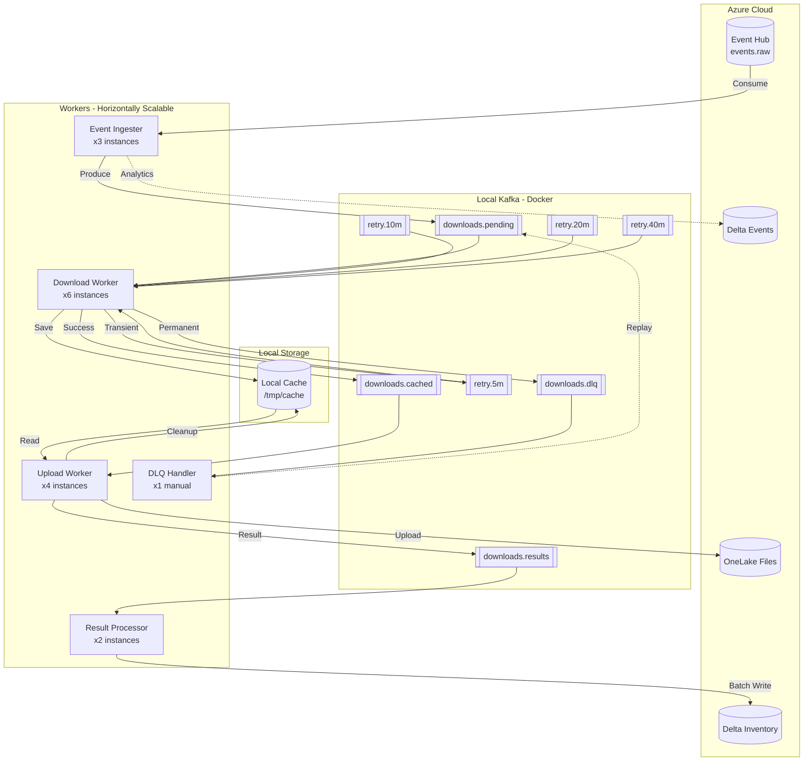
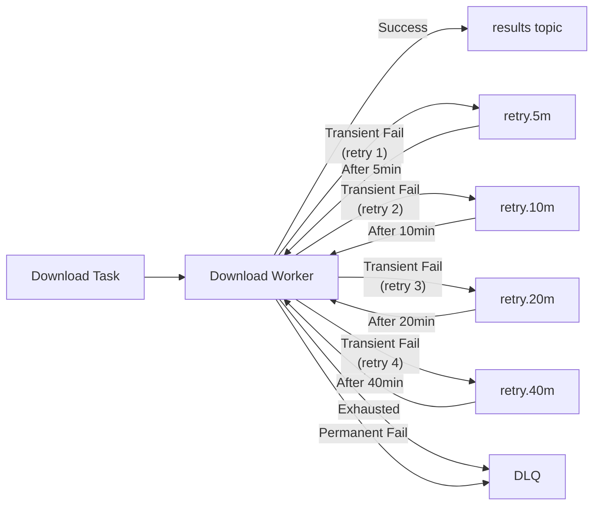

# Pipeline Architecture Comparison

## Old Architecture (Polling-Based)

**Characteristics:**
- Polling interval: 60 seconds
- Single process architecture
- Delta Lake table for retry queue
- End-to-end latency: 60-120 seconds
- Max 10 parallel downloads

---

## New Architecture (Kafka-Based, Decoupled Download/Upload)

**Characteristics:**
- Real-time event streaming
- Horizontally scalable workers
- **Decoupled download/upload** for independent scaling
- Local cache buffer protects against OneLake issues
- Kafka topics for retry with exponential backoff
- End-to-end latency: <5 seconds (p95)
- Max 50 parallel downloads, 40 parallel uploads

---

## Retry Flow Detail

---

## Key Differences

| Aspect | Old | New |
|--------|-----|-----|
| **Event Delivery** | Polling (60s) | Real-time streaming |
| **Scaling** | Single process | Horizontal (1-20 workers) |
| **Architecture** | Coupled download/upload | Decoupled (cache buffer) |
| **Retry Mechanism** | Delta table polling | Kafka topics with delays |
| **Latency (p95)** | 60-120 seconds | <5 seconds |
| **Parallelism** | 10 downloads | 50 downloads + 40 uploads |
| **Failure Handling** | Re-poll on next cycle | Exponential backoff + DLQ |
| **OneLake Resilience** | Blocking on failures | Cache buffer, independent upload |
| **Observability** | Basic logging | Prometheus metrics + Grafana |
