# Kafka Pipeline Architecture

## Domain-Based Architecture

The pipeline is organized into two independent processing domains:

### Domain Structure

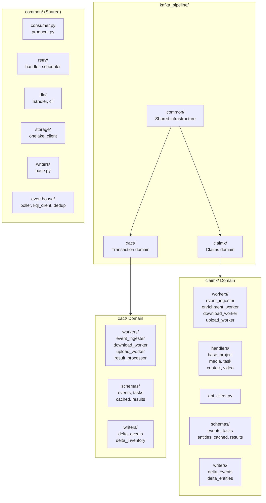

### Domain Comparison

| Aspect | xact Domain | claimx Domain |
|--------|-------------|---------------|
| **Purpose** | Direct file downloads from transaction events | API enrichment then media file downloads |
| **Workers** | event-ingester → download → upload → result-processor | ingester → enricher → download → upload |
| **Topics** | `xact.events.raw`<br/>`xact.downloads.*` | `claimx.events.raw`<br/>`claimx.enrichment.pending`<br/>`claimx.downloads.*` |
| **Data Flow** | Event → Download Task → File | Event → Enrichment Task → Entity Data + Download Task → File |
| **External API** | None (direct downloads) | ClaimX API (projects, contacts, media, tasks, video) |
| **Delta Tables** | `xact_events`<br/>`xact_attachments` | `claimx_events`<br/>7 entity tables<br/>(projects, contacts, media, etc.) |
| **CLI Commands** | `xact-event-ingester`<br/>`xact-download`<br/>`xact-upload`<br/>`xact-result-processor` | `claimx-ingester`<br/>`claimx-enricher`<br/>`claimx-downloader`<br/>`claimx-uploader` |

### claimx Unique Components

The claimx domain includes additional components not present in xact:

**Enrichment Worker**
- Consumes `claimx.enrichment.pending` topic
- Routes events to specialized handlers based on event type
- Calls ClaimX API to fetch entity data (projects, contacts, media, tasks, video)
- Writes entity data to 7 Delta tables
- Produces download tasks for media files

**Event Handlers**
- `ProjectHandler`: Fetches project and contact data
- `MediaHandler`: Fetches media metadata with presigned URLs (batched by project)
- `TaskHandler`: Fetches task assignments and templates
- `VideoCollabHandler`: Fetches video collaboration data
- `PolicyholderHandler`: No-op handler for policyholder events

**API Client**
- `ClaimXApiClient`: HTTP client with rate limiting, circuit breaker, and retry logic
- Configurable concurrency, timeout, and authentication (Basic auth)

### Topic Naming Convention

Both domains use consistent topic naming: `{domain}.{workflow}.{stage}`

**xact Topics:**
- `xact.events.raw`
- `xact.downloads.pending`
- `xact.downloads.cached`
- `xact.downloads.results`
- `xact.downloads.retry.*`
- `xact.downloads.dlq`

**claimx Topics:**
- `claimx.events.raw`
- `claimx.enrichment.pending`
- `claimx.downloads.pending`
- `claimx.downloads.cached`
- `claimx.downloads.results`
- `claimx.downloads.retry.*`
- `claimx.downloads.dlq`

---

## Detailed Component Documentation

> **Note:** The detailed architecture diagrams below focus on the xact domain implementation.
> The claimx domain follows similar patterns with the addition of the enrichment workflow.
> See the Domain Comparison table above for key differences.

## Overview: Pipeline Startup & Event Ingestion (xact Domain)

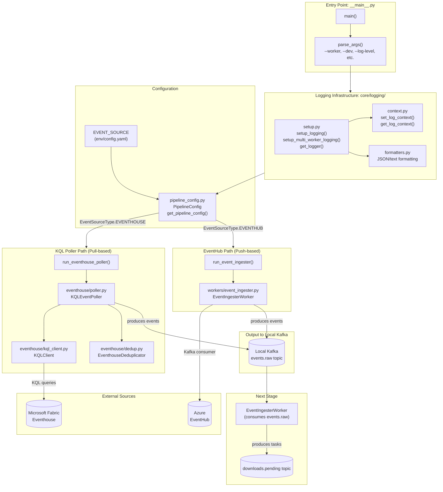

---

## Detailed: run_eventhouse_poller() Flow

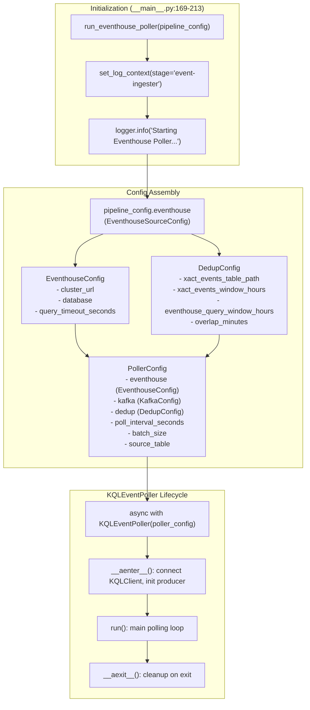

---

## KQLEventPoller Deep Dive

### Component Architecture

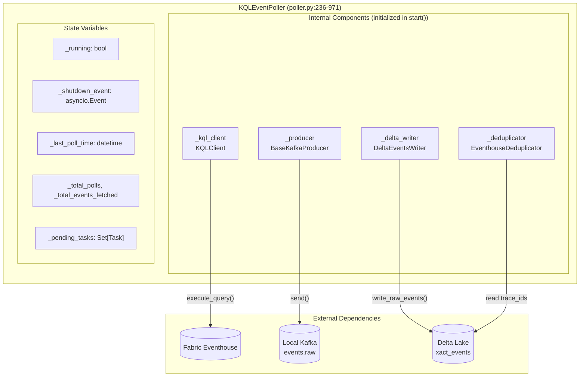

### Lifecycle Methods

| Method | Location | Purpose |
|--------|----------|---------|
| `__init__` | :261-295 | Initialize config, state vars, component placeholders |
| `__aenter__` | :297-300 | Call `start()`, return self |
| `start` | :306-329 | Initialize KQLClient, Deduplicator, Producer, DeltaWriter |
| `run` | :521-560 | Main polling loop until shutdown |
| `stop` | :402-440 | Wait for pending tasks, cleanup components |
| `__aexit__` | :302-304 | Call `stop()` |

### Main Polling Loop (`run`)

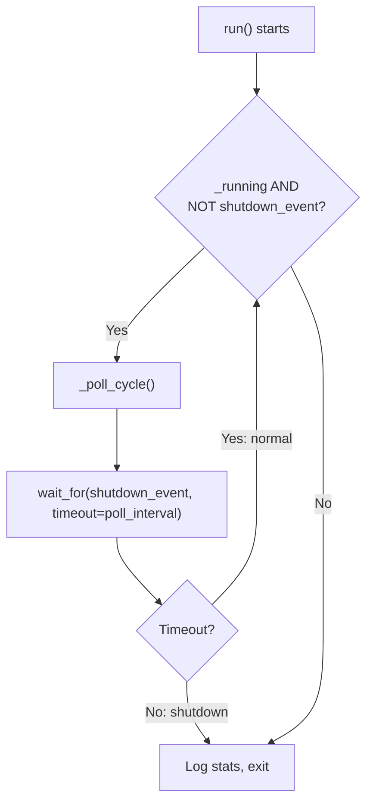

### Poll Cycle (`_poll_cycle`) - Single Iteration

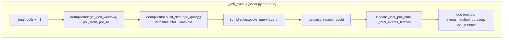

### Process Results (`_process_results`)

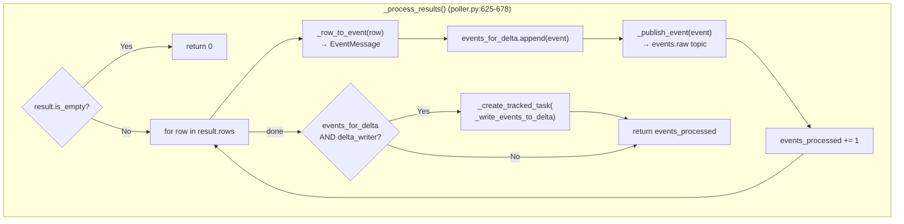

### Key Method Details

| Method | Location | What It Does |
|--------|----------|--------------|
| `_poll_cycle` | :562-623 | Execute one poll: get window, build query, execute, process results |
| `_process_results` | :625-678 | Convert rows → EventMessage, publish to Kafka, queue Delta write |
| `_publish_event` | :680-713 | Send EventMessage to `events.raw` topic via producer |
| `_row_to_event` | :715-773 | Map KQL row dict → `EventMessage` (handles column name variants) |
| `_write_events_to_delta` | :904-953 | Background task: write to Delta, update dedup cache |
| `_create_tracked_task` | :331-400 | Create background task with logging & cleanup callbacks |
| `_wait_for_pending_tasks` | :442-519 | Graceful shutdown: wait for background tasks with timeout |

---

## KQLClient Deep Dive (kql_client.py:299-675)

### Architecture

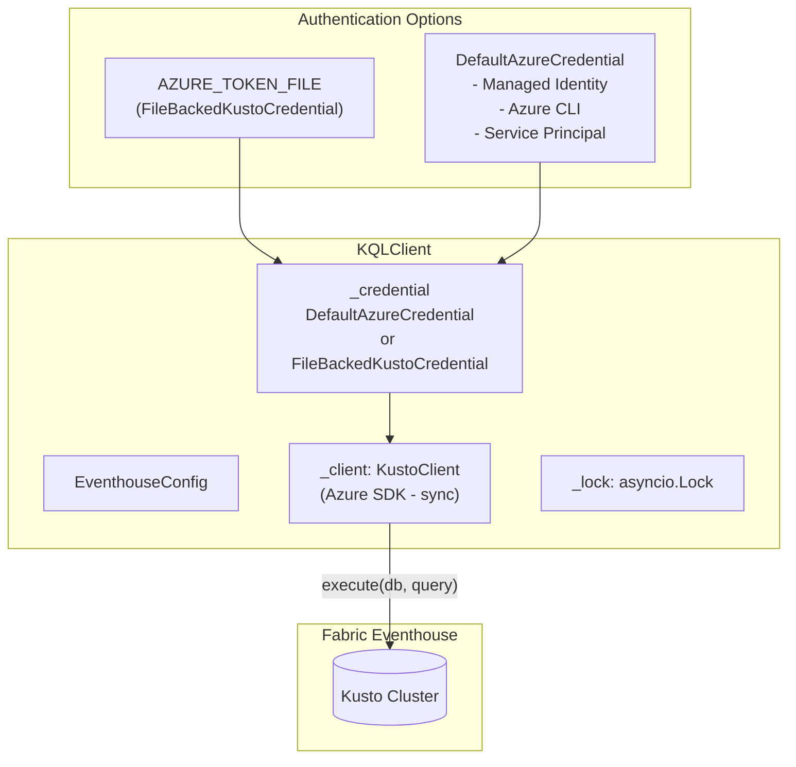

### EventhouseConfig

```python
@dataclass
class EventhouseConfig:
    cluster_url: str           # e.g., "https://your-cluster.kusto.fabric.microsoft.com"
    database: str              # e.g., "your-database"
    query_timeout_seconds: int = 120
    max_retries: int = 3
    retry_base_delay_seconds: float = 1.0
    retry_max_delay_seconds: float = 30.0
    max_connections: int = 10
```

### Key Methods

| Method | Location | Purpose |
|--------|----------|---------|
| `connect()` | :338-420 | Establish connection with auth (token file or DefaultAzureCredential) |
| `close()` | :422-438 | Cleanup client and credential |
| `execute_query()` | :440-536 | Execute KQL with retry logic (exponential backoff) |
| `_execute_query_impl()` | :538-649 | Actual query execution in thread pool (KustoClient is sync) |
| `health_check()` | :651-670 | Verify connection with `print 1` query |

### Query Execution Flow

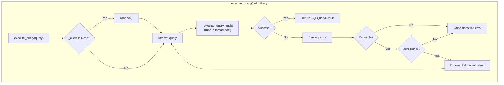

### KQLQueryResult

```python
@dataclass
class KQLQueryResult:
    rows: list[dict]           # Query results as list of dicts
    query_duration_ms: float   # Execution time
    row_count: int             # Number of rows returned
    is_partial: bool           # Whether result is truncated
    query_text: str            # Original query (for debugging)

    @property
    def is_empty(self) -> bool:
        return self.row_count == 0
```

---

## EventhouseDeduplicator Deep Dive (dedup.py:48-401)

### Architecture

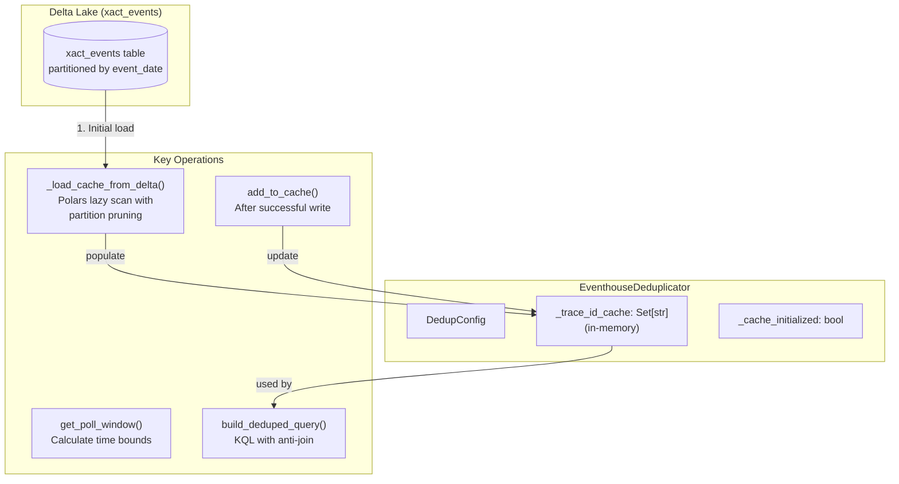

### DedupConfig

```python
@dataclass
class DedupConfig:
    xact_events_table_path: str              # abfss:// path to Delta table
    xact_events_window_hours: int = 24       # How far back to load trace_ids
    eventhouse_query_window_hours: int = 1   # Initial poll window (first poll)
    overlap_minutes: int = 5                 # Safety overlap between polls
    max_trace_ids_per_query: int = 50_000    # Max trace_ids in anti-join
    eventhouse_trace_id_column: str = "traceId"  # Column name in Eventhouse
```

### Deduplication Strategy

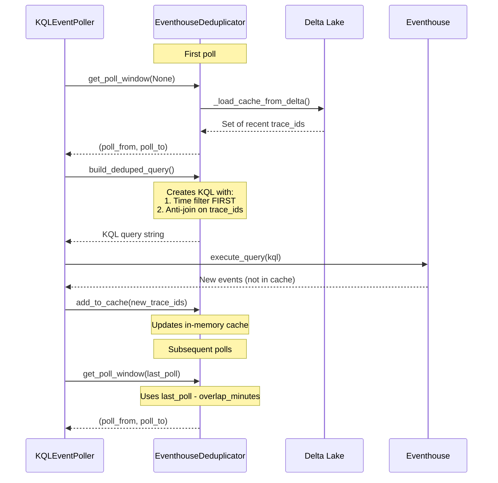

### Generated KQL Query Structure

```kql
Events
| where ingestion_time() >= datetime(2024-01-15T10:00:00Z)   -- TIME FILTER FIRST!
| where ingestion_time() < datetime(2024-01-15T11:00:00Z)
| where traceId !in (dynamic(['trace-1', 'trace-2', ...]))   -- Anti-join filter
| order by ingestion_time() asc
| take 1000
```

### Key Methods

| Method | Location | Purpose |
|--------|----------|---------|
| `_load_cache_from_delta()` | :92-170 | Load recent trace_ids with partition pruning (Polars) |
| `get_recent_trace_ids()` | :172-198 | Return cached trace_ids (loads from Delta on first call) |
| `add_to_cache()` | :200-229 | Add newly processed trace_ids to cache |
| `build_kql_anti_join_filter()` | :239-278 | Generate `traceId !in (dynamic([...]))` clause |
| `build_deduped_query()` | :280-364 | Build complete KQL with time filter + anti-join |
| `get_poll_window()` | :366-401 | Calculate `(poll_from, poll_to)` with overlap |

---

## EventIngesterWorker Deep Dive (event_ingester.py:44-553)

### Architecture

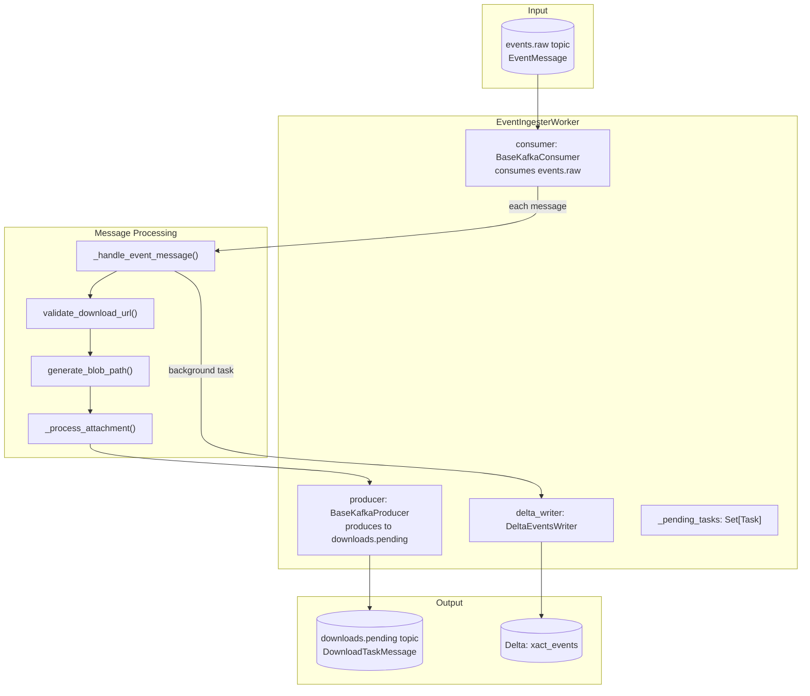

### Workflow

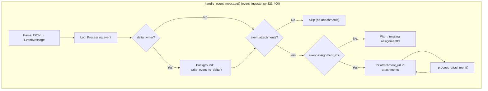

### Attachment Processing

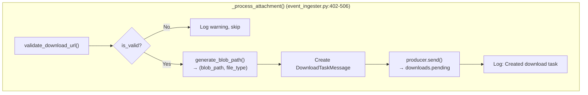

### DownloadTaskMessage (Output Schema)

```python
@dataclass
class DownloadTaskMessage:
    trace_id: str              # From event
    attachment_url: str        # URL to download
    blob_path: str             # Generated OneLake path
    status_subtype: str        # e.g., "documentsReceived"
    file_type: str             # e.g., "pdf", "xml"
    assignment_id: str         # For path generation
    estimate_version: Optional[int]
    retry_count: int = 0       # Retry tracking
    event_type: str            # Domain (e.g., "xact")
    event_subtype: str         # Same as status_subtype
    original_timestamp: datetime
```

### Key Methods

| Method | Location | Purpose |
|--------|----------|---------|
| `start()` | :123-148 | Initialize producer & consumer, begin consuming |
| `stop()` | :150-171 | Wait for pending tasks, stop consumer & producer |
| `_handle_event_message()` | :323-400 | Parse event, trigger Delta write, process attachments |
| `_process_attachment()` | :402-506 | Validate URL, generate path, produce DownloadTaskMessage |
| `_write_event_to_delta()` | :508-553 | Background Delta write for analytics |

---

## DownloadWorker Deep Dive (download_worker.py:77-962)

### Architecture

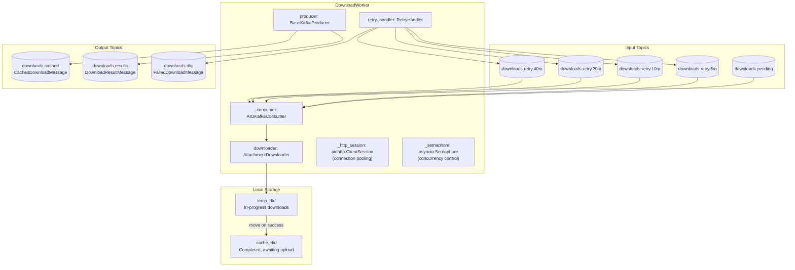

### Concurrent Processing Flow

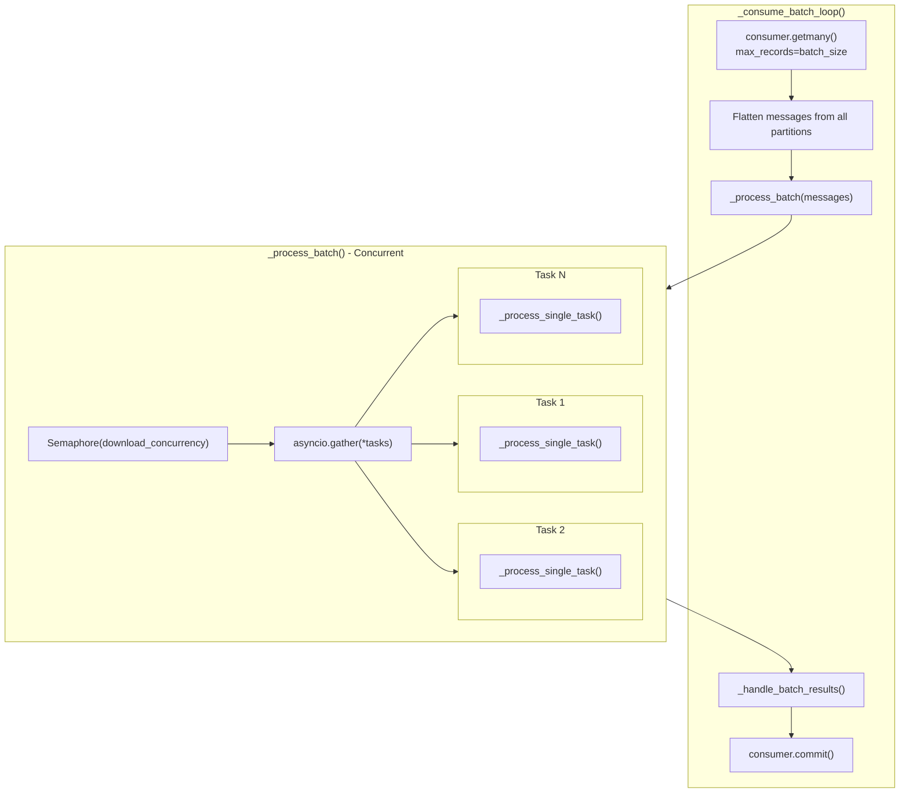

### Single Task Processing

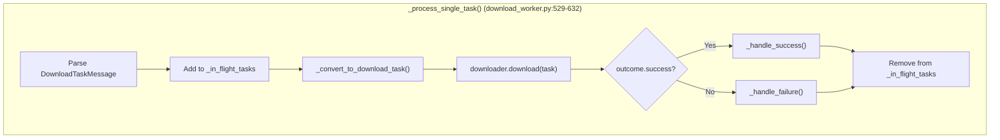

### Success Handler

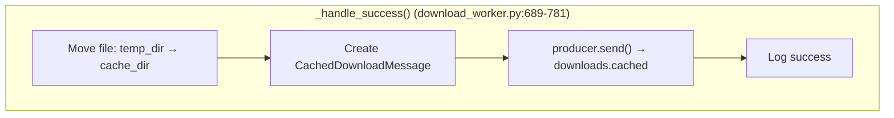

### Failure Handler & Retry Logic

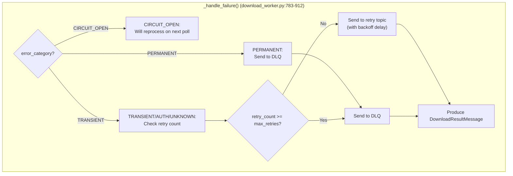

### RetryHandler (retry/handler.py)

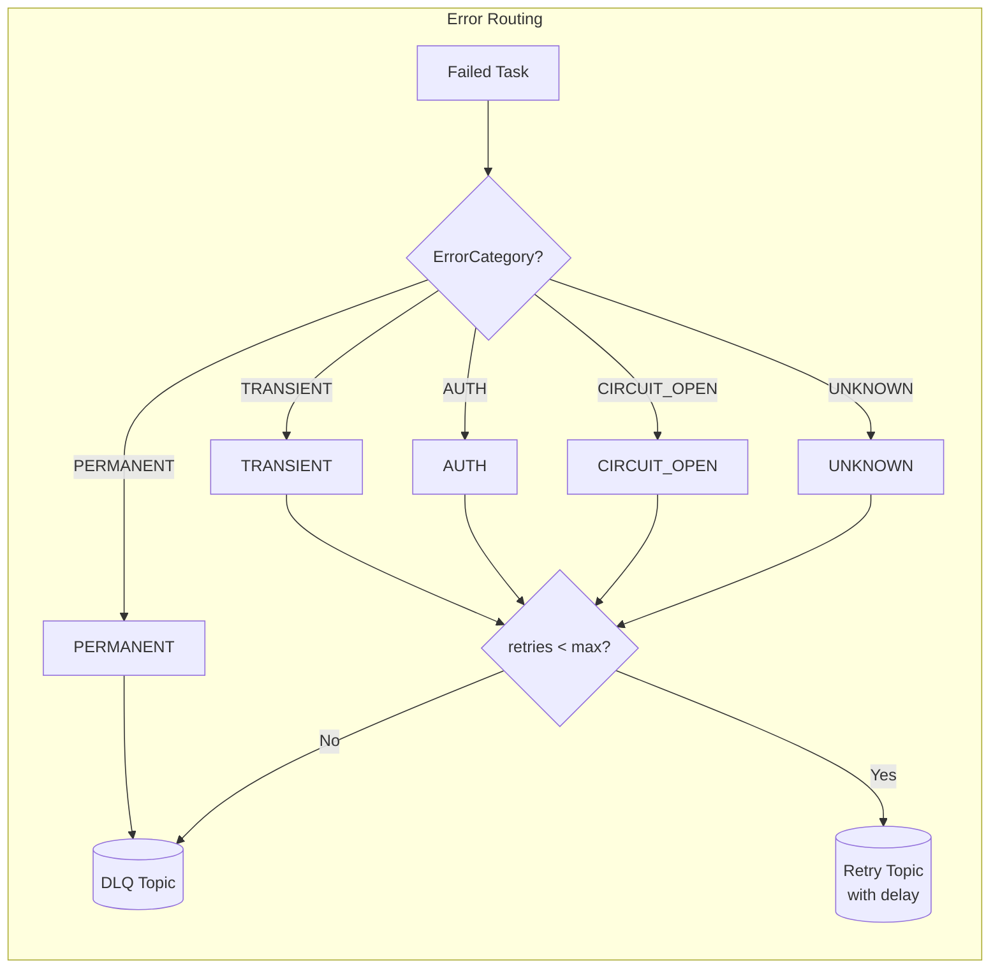

### Retry Delays (Exponential Backoff)

| Retry # | Delay | Topic |
|---------|-------|-------|
| 0 → 1 | 5 min | `downloads.retry.5m` |
| 1 → 2 | 10 min | `downloads.retry.10m` |
| 2 → 3 | 20 min | `downloads.retry.20m` |
| 3 → 4 | 40 min | `downloads.retry.40m` |
| 4+ | — | DLQ (retries exhausted) |

### Output Schemas

**CachedDownloadMessage** (→ `downloads.cached` → UploadWorker)
```python
class CachedDownloadMessage(BaseModel):
    trace_id: str
    attachment_url: str
    destination_path: str          # OneLake target path
    local_cache_path: str          # Local file path
    bytes_downloaded: int
    content_type: Optional[str]
    event_type: str                # Domain (e.g., "xact")
    event_subtype: str
    status_subtype: str
    file_type: str
    assignment_id: str
    original_timestamp: datetime
    downloaded_at: datetime
    metadata: Dict[str, Any]
```

**DownloadResultMessage** (→ `downloads.results` → ResultProcessor)
```python
class DownloadResultMessage(BaseModel):
    trace_id: str
    attachment_url: str
    blob_path: str
    status_subtype: str
    file_type: str
    assignment_id: str
    status: Literal["completed", "failed", "failed_permanent"]
    http_status: Optional[int]
    bytes_downloaded: int
    retry_count: int
    error_message: Optional[str]
    created_at: datetime
```

### Key Methods

| Method | Location | Purpose |
|--------|----------|---------|
| `start()` | :174-250 | Initialize HTTP session, producer, consumer, retry handler; start batch loop |
| `stop()` | :303-362 | Wait for in-flight downloads, commit offsets, cleanup resources |
| `request_shutdown()` | :283-301 | Request graceful shutdown after current batch |
| `_consume_batch_loop()` | :397-460 | Main loop: getmany → process batch → commit |
| `_process_batch()` | :462-527 | Concurrent processing with semaphore control |
| `_process_single_task()` | :529-632 | Download one file, route success/failure |
| `_handle_success()` | :689-781 | Move to cache, produce CachedDownloadMessage |
| `_handle_failure()` | :783-912 | Route to retry/DLQ, produce DownloadResultMessage |

### Configuration

| Setting | Default | Description |
|---------|---------|-------------|
| `download_concurrency` | 10 | Max concurrent downloads (semaphore limit) |
| `download_batch_size` | 100 | Max messages per `getmany()` call |
| `retry_delays` | [300, 600, 1200, 2400] | Retry delays in seconds |
| `max_retries` | 4 | Max retry attempts before DLQ |
| `cache_dir` | `/tmp/kafka_cache` | Local cache for completed downloads |

---

## UploadWorker Deep Dive (upload_worker.py:57-577)

### Architecture

```mermaid
flowchart TB
    subgraph Worker["UploadWorker"]
        consumer["_consumer: AIOKafkaConsumer"]
        producer["producer: BaseKafkaProducer"]
        clients["onelake_clients: Dict[str, OneLakeClient]<br/>(per-domain routing)"]
        semaphore["_semaphore: asyncio.Semaphore<br/>(upload_concurrency)"]
        tasks["_in_flight_tasks: Set[str]"]
    end

    subgraph Input["Input Topic"]
        cached[("downloads.cached<br/>CachedDownloadMessage")]
    end

    subgraph LocalStorage["Local Storage"]
        cache["cache_dir/<br/>Downloaded files"]
    end

    subgraph OneLake["OneLake (per-domain)"]
        xact[("xact lakehouse")]
        claimx[("claimx lakehouse")]
        fallback[("_fallback<br/>if domain not found")]
    end

    subgraph Output["Output"]
        results[("downloads.results<br/>DownloadResultMessage")]
    end

    cached --> consumer
    consumer --> cache
    cache -->|"upload"| clients
    clients --> xact
    clients --> claimx
    clients --> fallback
    producer --> results
```

### Upload Processing Flow

```mermaid
flowchart TB
    subgraph BatchLoop["_consume_batch_loop()"]
        getmany["consumer.getmany()<br/>max_records=upload_batch_size"]
        flatten["Flatten messages from all partitions"]
        process_batch["_process_batch(messages)"]
        commit["consumer.commit()"]
    end

    subgraph ProcessBatch["_process_batch() - Concurrent"]
        tasks["Create tasks for each message"]
        gather["asyncio.gather(*tasks)"]
        handle_exceptions["Handle any exceptions in results"]
    end

    getmany --> flatten --> process_batch --> ProcessBatch --> commit
```

### Single Upload Processing

```mermaid
flowchart TB
    subgraph ProcessSingle["_process_single_upload() (upload_worker.py:396-557)"]
        parse["Parse CachedDownloadMessage"]
        track["Add trace_id to _in_flight_tasks"]
        verify["Verify cached file exists"]
        route["Route by event_type (domain)"]
        lookup{"onelake_clients[domain]?"}
        fallback["Use _fallback client"]
        upload["onelake_client.upload_file()"]
        success_result["Create DownloadResultMessage<br/>status='completed'"]
        produce["producer.send() → downloads.results"]
        cleanup["_cleanup_cache_file()"]
        untrack["Remove from _in_flight_tasks"]
    end

    parse --> track --> verify --> route --> lookup
    lookup -->|Yes| upload
    lookup -->|No| fallback --> upload
    upload --> success_result --> produce --> cleanup --> untrack
```

### Failure Handling

```mermaid
flowchart TB
    subgraph FailureHandler["On Upload Error"]
        catch["Exception caught"]
        create_fail["Create DownloadResultMessage<br/>status='failed_permanent'"]
        produce["producer.send() → downloads.results"]
        keep_file["Keep file in cache for manual review"]
        log["Log error"]
    end

    catch --> create_fail --> produce --> keep_file --> log
```

### OneLakeClient (storage/onelake_client.py)

```mermaid
flowchart TB
    subgraph OneLakeClient["OneLakeClient (Async Wrapper)"]
        async_client["OneLakeClient<br/>(async interface)"]
        legacy["_legacy_client: LegacyOneLakeClient<br/>(sync Azure SDK)"]
        to_thread["asyncio.to_thread()<br/>(non-blocking)"]
    end

    subgraph Operations["Operations"]
        upload_file["upload_file()<br/>(streaming, memory-efficient)"]
        upload_bytes["upload_bytes()"]
        exists["exists()"]
        delete["delete()"]
    end

    subgraph Azure["Azure Data Lake Storage Gen2"]
        dfs[("OneLake DFS endpoint<br/>onelake.dfs.fabric.microsoft.com")]
    end

    async_client --> to_thread --> legacy --> dfs
    Operations --> async_client
```

### Domain Routing

The UploadWorker routes uploads to domain-specific OneLake paths:

```python
# Configuration (config.yaml or env vars)
onelake_domain_paths:
  xact: "abfss://workspace@onelake.dfs.fabric.microsoft.com/xact_lakehouse/Files"
  claimx: "abfss://workspace@onelake.dfs.fabric.microsoft.com/claimx_lakehouse/Files"

# Fallback for unknown domains
ONELAKE_BASE_PATH: "abfss://workspace@onelake.dfs.fabric.microsoft.com/default_lakehouse/Files"
```

### Key Methods

| Method | Location | Purpose |
|--------|----------|---------|
| `start()` | :143-215 | Initialize semaphore, producer, OneLake clients, consumer; start batch loop |
| `stop()` | :237-292 | Wait for in-flight uploads (30s timeout), cleanup all resources |
| `request_shutdown()` | :217-235 | Request graceful shutdown after current batch |
| `_consume_batch_loop()` | :332-360 | Main loop: getmany → process batch → commit |
| `_process_batch()` | :362-387 | Concurrent processing with semaphore control |
| `_process_single_upload()` | :396-557 | Upload one file, produce result message |
| `_cleanup_cache_file()` | :559-577 | Delete local file and empty parent dir |

### Configuration

| Setting | Default | Description |
|---------|---------|-------------|
| `upload_concurrency` | 10 | Max concurrent uploads (semaphore limit) |
| `upload_batch_size` | 100 | Max messages per `getmany()` call |
| `onelake_domain_paths` | — | Per-domain OneLake paths (dict) |
| `onelake_base_path` | — | Fallback path for unknown domains |

---

## ResultProcessor Deep Dive (result_processor.py:34-427)

### Architecture

```mermaid
flowchart TB
    subgraph Processor["ResultProcessor"]
        consumer["_consumer: BaseKafkaConsumer"]
        inv_writer["_inventory_writer: DeltaInventoryWriter"]
        fail_writer["_failed_writer: DeltaFailedAttachmentsWriter<br/>(optional)"]
        batch["_batch: List[DownloadResultMessage]"]
        fail_batch["_failed_batch: List[DownloadResultMessage]"]
        lock["_batch_lock: asyncio.Lock"]
        flush_task["_flush_task: asyncio.Task<br/>(periodic flush)"]
    end

    subgraph Input["Input Topic"]
        results[("downloads.results<br/>DownloadResultMessage")]
    end

    subgraph DeltaTables["Delta Lake Tables"]
        inventory[("xact_attachments<br/>successful downloads")]
        failed[("xact_attachments_failed<br/>permanent failures")]
    end

    results --> consumer
    consumer --> batch
    consumer --> fail_batch
    batch -->|"flush"| inv_writer --> inventory
    fail_batch -->|"flush"| fail_writer --> failed
```

### Result Routing

```mermaid
flowchart TB
    subgraph HandleResult["_handle_result() (result_processor.py:218-288)"]
        parse["Parse DownloadResultMessage"]
        check_status{"result.status?"}

        success["status='success'"]
        add_batch["Add to _batch"]
        check_size1{"len(_batch) >= batch_size?"}
        flush1["_flush_batch()"]

        permanent["status='failed_permanent'"]
        check_writer{"_failed_writer?"}
        add_fail["Add to _failed_batch"]
        check_size2{"len(_failed_batch) >= batch_size?"}
        flush2["_flush_failed_batch()"]

        transient["status='failed_transient'"]
        skip["Skip (still retrying)"]
    end

    parse --> check_status
    check_status -->|success| success --> add_batch --> check_size1
    check_size1 -->|Yes| flush1
    check_status -->|failed_permanent| permanent --> check_writer
    check_writer -->|Yes| add_fail --> check_size2
    check_size2 -->|Yes| flush2
    check_writer -->|No| skip
    check_status -->|failed_transient| transient --> skip
```

### Batching Strategy

```mermaid
flowchart TB
    subgraph Batching["Dual Flush Triggers"]
        subgraph SizeFlush["Size-based Flush"]
            size_check["batch_size >= 100"]
            immediate["Immediate flush"]
        end

        subgraph TimeoutFlush["Timeout-based Flush (_periodic_flush)"]
            timer["Check every 1 second"]
            elapsed{"elapsed >= 5s?"}
            timeout_flush["Flush if batch not empty"]
        end

        subgraph ShutdownFlush["Shutdown Flush"]
            stop_called["stop() called"]
            final_flush["Flush any pending batches"]
        end
    end

    size_check --> immediate
    timer --> elapsed -->|Yes| timeout_flush
    stop_called --> final_flush
```

### Delta Writers

```mermaid
flowchart TB
    subgraph DeltaInventoryWriter["DeltaInventoryWriter (delta_inventory.py:45-199)"]
        write_results["write_results(List[DownloadResultMessage])"]
        to_df["_results_to_dataframe()<br/>(Polars DataFrame)"]
        merge["_delta_writer.merge()<br/>on (trace_id, attachment_url)"]
        delta1[("xact_attachments<br/>Z-order: trace_id, created_at")]
    end

    subgraph DeltaFailedAttachmentsWriter["DeltaFailedAttachmentsWriter (delta_inventory.py:202-369)"]
        write_failed["write_results(List[DownloadResultMessage])"]
        to_df2["_results_to_dataframe()"]
        merge2["_delta_writer.merge()<br/>on (trace_id, attachment_url)"]
        delta2[("xact_attachments_failed<br/>Z-order: trace_id, failed_at")]
    end

    write_results --> to_df --> merge --> delta1
    write_failed --> to_df2 --> merge2 --> delta2
```

### xact_attachments Schema

```python
INVENTORY_SCHEMA = {
    "trace_id": pl.Utf8,           # Primary key
    "attachment_url": pl.Utf8,     # Primary key
    "blob_path": pl.Utf8,          # OneLake destination
    "status_subtype": pl.Utf8,     # e.g., "documentsReceived"
    "file_type": pl.Utf8,          # e.g., "pdf"
    "assignment_id": pl.Utf8,
    "status": pl.Utf8,             # completed/failed/failed_permanent
    "http_status": pl.Int64,
    "bytes_downloaded": pl.Int64,
    "retry_count": pl.Int64,
    "error_message": pl.Utf8,
    "created_at": pl.Datetime,
    "expires_at": pl.Datetime,     # URL expiration (optional)
    "expired_at_ingest": pl.Boolean,
}
```

### xact_attachments_failed Schema

```python
FAILED_SCHEMA = {
    "trace_id": pl.Utf8,
    "attachment_url": pl.Utf8,
    "error_message": pl.Utf8,
    "error_category": pl.Utf8,
    "failed_at": pl.Datetime,
    "processing_time_ms": pl.Int64,
    "created_at": pl.Datetime,
    "created_date": pl.Date,       # Partition column
}
```

### Key Methods

| Method | Location | Purpose |
|--------|----------|---------|
| `start()` | :131-165 | Start flush task and consumer (blocks until stopped) |
| `stop()` | :167-216 | Cancel flush task, flush pending batches, stop consumer |
| `_handle_result()` | :218-288 | Route results by status, add to appropriate batch |
| `_periodic_flush()` | :290-340 | Background task: check timeout every 1s, flush if needed |
| `_flush_batch()` | :342-381 | Write success batch to xact_attachments Delta table |
| `_flush_failed_batch()` | :383-422 | Write failed batch to xact_attachments_failed Delta table |

### Configuration

| Setting | Default | Description |
|---------|---------|-------------|
| `BATCH_SIZE` | 100 | Flush when batch reaches this size |
| `BATCH_TIMEOUT_SECONDS` | 5 | Flush if elapsed time exceeds this |
| `inventory_table_path` | — | Path to xact_attachments Delta table |
| `failed_table_path` | — | Path to xact_attachments_failed (optional) |

---

## End-to-End Flow: Eventhouse Mode

```mermaid
sequenceDiagram
    participant Main as __main__.py
    participant Poller as KQLEventPoller
    participant KQL as KQLClient
    participant Dedup as EventhouseDeduplicator
    participant EH as Eventhouse
    participant Kafka as Local Kafka
    participant Ingester as EventIngesterWorker
    participant Delta as Delta Lake

    Main->>Poller: run_eventhouse_poller()
    activate Poller

    loop Every poll_interval_seconds
        Poller->>Dedup: get_poll_window()
        Dedup-->>Poller: (poll_from, poll_to)

        Poller->>Dedup: build_deduped_query()
        Dedup-->>Poller: KQL query

        Poller->>KQL: execute_query()
        KQL->>EH: KQL query
        EH-->>KQL: Results
        KQL-->>Poller: KQLQueryResult

        loop For each row
            Poller->>Poller: _row_to_event()
            Poller->>Kafka: _publish_event() → events.raw
        end

        Poller->>Delta: Background: _write_events_to_delta()
        Poller->>Dedup: add_to_cache(trace_ids)
    end

    Note over Ingester: Separate worker process

    Kafka->>Ingester: Consume events.raw
    activate Ingester

    loop For each EventMessage
        Ingester->>Delta: Background: _write_event_to_delta()

        loop For each attachment
            Ingester->>Ingester: validate_download_url()
            Ingester->>Ingester: generate_blob_path()
            Ingester->>Kafka: Send DownloadTaskMessage → downloads.pending
        end
    end

    deactivate Ingester
    deactivate Poller
```

---

## Logging Infrastructure

```mermaid
flowchart LR
    subgraph core_logging["core/logging/"]
        setup["setup.py"]
        context["context.py"]
        formatters["formatters.py"]
        filters["filters.py"]
        utilities["utilities.py"]
    end

    subgraph setup_funcs["setup.py Functions"]
        setup_logging["setup_logging()<br/>Single worker mode"]
        setup_multi["setup_multi_worker_logging()<br/>All workers mode"]
        get_logger["get_logger(name)"]
    end

    subgraph context_funcs["context.py Functions"]
        set_ctx["set_log_context()<br/>stage, worker_id, domain, cycle_id"]
        get_ctx["get_log_context()"]
        clear_ctx["clear_log_context()"]
    end

    setup --> setup_funcs
    context --> context_funcs

    subgraph Usage["Usage in __main__.py"]
        main_setup["main(): setup_logging() or setup_multi_worker_logging()"]
        worker_ctx["run_*(): set_log_context(stage='...')"]
        log_calls["logger.info(), logger.error(), etc."]
    end

    setup_funcs --> main_setup
    context_funcs --> worker_ctx
    main_setup --> log_calls
    worker_ctx --> log_calls
```

---

## When to Use KQL vs EventHub

| Aspect | KQL (Eventhouse) | EventHub |
|--------|------------------|----------|
| **Mode** | Pull-based polling | Push-based streaming |
| **Latency** | Higher (poll interval) | Real-time |
| **Deduplication** | Built-in via Delta table | Not built-in |
| **Configuration** | `EVENT_SOURCE=eventhouse` | `EVENT_SOURCE=eventhub` |
| **Use Case** | Batch processing, historical queries | Real-time event streaming |

---

## Metrics & Monitoring (metrics.py, monitoring.py)

### Prometheus Metrics Architecture

```mermaid
flowchart TB
    subgraph Workers["Pipeline Workers"]
        download["DownloadWorker"]
        upload["UploadWorker"]
        result["ResultProcessor"]
        ingester["EventIngesterWorker"]
    end

    subgraph Metrics["metrics.py - Prometheus Instrumentation"]
        counters["Counters"]
        gauges["Gauges"]
        histograms["Histograms"]
    end

    subgraph MetricTypes["Metric Types"]
        subgraph Counters["Counters (monotonic)"]
            produced["messages_produced_total"]
            consumed["messages_consumed_total"]
            errors["processing_errors_total"]
            delta["delta_writes_total"]
        end

        subgraph Gauges["Gauges (current value)"]
            lag["consumer_lag"]
            conn["kafka_connection_status"]
            circuit["circuit_breaker_state"]
            concurrent["downloads_concurrent"]
        end

        subgraph Histograms["Histograms (distributions)"]
            proc_time["message_processing_duration_seconds"]
            batch_time["batch_processing_duration_seconds"]
            delta_time["delta_write_duration_seconds"]
        end
    end

    subgraph Monitoring["monitoring.py"]
        server["MonitoringServer<br/>(aiohttp)"]
        parser["MetricsParser"]
        dashboard["HTML Dashboard"]
        api["JSON API /api/stats"]
    end

    Workers -->|"call helper functions"| Metrics
    Metrics -->|"exposes"| prometheus[("/metrics endpoint")]
    prometheus -->|"scraped by"| server
    server --> parser --> dashboard
    server --> api
```

### Prometheus Metrics Reference

| Metric | Type | Labels | Purpose |
|--------|------|--------|---------|
| `kafka_messages_produced_total` | Counter | topic, status | Messages sent to Kafka |
| `kafka_messages_consumed_total` | Counter | topic, consumer_group, status | Messages read from Kafka |
| `kafka_processing_errors_total` | Counter | topic, consumer_group, error_category | Errors by category |
| `kafka_consumer_lag` | Gauge | topic, partition, consumer_group | Messages behind high watermark |
| `kafka_connection_status` | Gauge | component | 1=connected, 0=disconnected |
| `kafka_circuit_breaker_state` | Gauge | component | 0=closed, 1=open, 2=half-open |
| `kafka_downloads_concurrent` | Gauge | worker | In-progress downloads |
| `delta_writes_total` | Counter | table, status | Delta table writes |
| `message_processing_duration_seconds` | Histogram | topic, consumer_group | Processing latency |

### Helper Functions

```python
# Recording events
record_message_produced(topic, message_bytes, success=True)
record_message_consumed(topic, consumer_group, message_bytes, success=True)
record_processing_error(topic, consumer_group, error_category)
record_delta_write(table, event_count, success=True)

# Updating state
update_consumer_lag(topic, partition, consumer_group, lag)
update_connection_status(component, connected)
update_circuit_breaker_state(component, state)  # 0=closed, 1=open, 2=half-open
update_downloads_concurrent(worker, count)
```

### MonitoringServer (monitoring.py)

```mermaid
flowchart TB
    subgraph Server["MonitoringServer (aiohttp)"]
        routes["Routes"]
        fetch["fetch_metrics()"]
        extract["_extract_topic_stats()<br/>_extract_worker_stats()"]
        render["render_dashboard()"]
    end

    subgraph Routes["HTTP Routes"]
        index["GET / → HTML dashboard"]
        api["GET /api/stats → JSON"]
    end

    subgraph Dashboard["Dashboard Data"]
        topics["TopicStats:<br/>- messages_consumed<br/>- messages_produced<br/>- total_lag<br/>- partitions"]
        workers["WorkerStats:<br/>- connected<br/>- circuit_breaker<br/>- in_flight<br/>- errors"]
    end

    fetch -->|"HTTP GET /metrics"| prometheus[("Prometheus endpoint")]
    prometheus --> extract --> topics
    extract --> workers
    topics --> render
    workers --> render
```

| Method | Purpose |
|--------|---------|
| `start()` | Start HTTP server on configured port (default: 8080) |
| `fetch_metrics()` | Fetch raw Prometheus metrics from `/metrics` endpoint |
| `get_dashboard_data()` | Collect and parse metrics into `DashboardData` |
| `render_dashboard()` | Generate Bootstrap HTML dashboard |
| `handle_api_stats()` | Return JSON stats for programmatic access |

---

## DLQ Management (dlq/handler.py, dlq/cli.py)

### DLQ Handler Architecture

```mermaid
flowchart TB
    subgraph DLQHandler["DLQHandler (dlq/handler.py)"]
        consumer["_consumer: BaseKafkaConsumer<br/>(manual commit)"]
        producer["_producer: BaseKafkaProducer"]
        audit["audit_logger<br/>(file-based audit trail)"]
    end

    subgraph Input["Input"]
        dlq[("downloads.dlq<br/>FailedDownloadMessage")]
    end

    subgraph Operations["Operations"]
        parse["parse_dlq_message()"]
        replay["replay_message()"]
        ack["acknowledge_message()"]
    end

    subgraph Output["Output"]
        pending[("downloads.pending<br/>(replayed messages)")]
        audit_file[("dlq_audit.log")]
    end

    dlq --> consumer --> parse
    parse --> replay --> producer --> pending
    parse --> ack
    replay --> audit --> audit_file
    ack --> audit
```

### DLQ Message Structure

```python
class FailedDownloadMessage(BaseModel):
    trace_id: str
    attachment_url: str
    retry_count: int
    error_category: str          # PERMANENT, TRANSIENT, AUTH, etc.
    final_error: str             # Error message
    failed_at: datetime
    original_task: DownloadTaskMessage  # Original task for replay
```

### DLQHandler Key Methods

| Method | Location | Purpose |
|--------|----------|---------|
| `start()` | :86-120 | Start consumer (manual commit mode) and producer |
| `stop()` | :122-139 | Cleanup resources |
| `parse_dlq_message()` | :200-226 | Parse FailedDownloadMessage from Kafka record |
| `replay_message()` | :228-315 | Send message back to pending topic (retry_count=0) |
| `acknowledge_message()` | :319-374 | Commit offset, marking message as handled |

### DLQ CLI (dlq/cli.py)

```mermaid
flowchart LR
    subgraph CLI["DLQCLIManager"]
        fetch["fetch_messages()"]
        list["list_messages()"]
        view["view_message(trace_id)"]
        replay["replay_message(trace_id)"]
        resolve["resolve_message(trace_id)"]
    end

    subgraph Commands["CLI Commands"]
        cmd_list["python -m kafka_pipeline.dlq.cli list"]
        cmd_view["python -m kafka_pipeline.dlq.cli view <trace_id>"]
        cmd_replay["python -m kafka_pipeline.dlq.cli replay <trace_id>"]
        cmd_resolve["python -m kafka_pipeline.dlq.cli resolve <trace_id>"]
    end

    cmd_list --> fetch --> list
    cmd_view --> view
    cmd_replay --> replay
    cmd_resolve --> resolve
```

### CLI Commands

| Command | Purpose |
|---------|---------|
| `list` | Display table of DLQ messages (offset, trace_id, retry_count, error_category, URL) |
| `view <trace_id>` | Show detailed info for a specific message |
| `replay <trace_id>` | Send message back to pending topic for reprocessing |
| `resolve <trace_id>` | Mark message as resolved (commit offset) |

---

## Retry Scheduler (retry/scheduler.py)

### DelayedRedeliveryScheduler Architecture

```mermaid
flowchart TB
    subgraph Scheduler["DelayedRedeliveryScheduler"]
        consumer["_consumer: BaseKafkaConsumer"]
        producer["producer: BaseKafkaProducer"]
        lag_monitor["_lag_check_task<br/>(background monitoring)"]
        paused["_paused: bool"]
    end

    subgraph Input["Retry Topics"]
        r1[("downloads.retry.5m")]
        r2[("downloads.retry.10m")]
        r3[("downloads.retry.20m")]
        r4[("downloads.retry.40m")]
    end

    subgraph Output["Output"]
        pending[("downloads.pending")]
    end

    r1 --> consumer
    r2 --> consumer
    r3 --> consumer
    r4 --> consumer

    consumer -->|"if delay elapsed"| producer --> pending
    consumer -->|"if delay NOT elapsed"| skip["Skip (no commit)"]
    lag_monitor -->|"if lag > threshold"| paused
    paused -->|"pauses"| consumer
```

### Redelivery Flow

```mermaid
sequenceDiagram
    participant Retry as Retry Topic
    participant Scheduler as DelayedRedeliveryScheduler
    participant Pending as downloads.pending

    Retry->>Scheduler: Message with retry_at in metadata
    Scheduler->>Scheduler: Check if _paused (high lag)
    alt Paused
        Scheduler-->>Retry: Don't commit (retry later)
    else Not Paused
        Scheduler->>Scheduler: Parse retry_at timestamp
        alt Delay Elapsed
            Scheduler->>Pending: Send to pending topic
            Scheduler->>Scheduler: Commit offset
        else Delay NOT Elapsed
            Scheduler-->>Retry: Don't commit (retry later)
        end
    end
```

### Backpressure Handling

The scheduler monitors the pending topic lag and pauses redelivery if it exceeds a threshold:

```python
# Configuration
lag_threshold: int = 1000          # Pause if pending lag > 1000
check_interval_seconds: int = 60   # Check every 60 seconds

# States
_paused = False  # Set to True when lag exceeds threshold
```

When paused:
- Messages are not redelivered to pending topic
- Offsets are not committed
- Messages will be reprocessed on next poll cycle
- Automatically resumes when lag drops below threshold

### Key Methods

| Method | Location | Purpose |
|--------|----------|---------|
| `start()` | :95-144 | Subscribe to all retry topics, start lag monitor |
| `stop()` | :146-174 | Cancel lag monitor, stop consumer |
| `_handle_retry_message()` | :176-313 | Check delay elapsed, redeliver if ready |
| `_monitor_pending_lag()` | :315-377 | Background task: pause/resume based on lag |
| `is_running` | :400-403 | Check if scheduler is running |
| `is_paused` | :405-408 | Check if paused due to high lag |

---

## Complete Pipeline Flow

```mermaid
flowchart LR
    subgraph Sources["Event Sources"]
        EH[("Eventhouse<br/>(KQL polling)")]
        EventHub[("EventHub<br/>(push-based)")]
    end

    subgraph Stage1["Stage 1: Event Ingestion"]
        poller["KQLEventPoller"]
        raw[("events.raw")]
        ingester["EventIngesterWorker"]
    end

    subgraph Stage2["Stage 2: Download"]
        pending[("downloads.pending")]
        download["DownloadWorker"]
        retry[("downloads.retry.*")]
        dlq[("downloads.dlq")]
        cache["Local Cache"]
    end

    subgraph Stage3["Stage 3: Upload"]
        cached[("downloads.cached")]
        upload["UploadWorker"]
        onelake[("OneLake<br/>Lakehouses")]
    end

    subgraph Stage4["Stage 4: Results"]
        results[("downloads.results")]
        processor["ResultProcessor"]
        inventory[("xact_attachments<br/>Delta Table")]
        failed[("xact_attachments_failed<br/>Delta Table")]
    end

    EH --> poller --> raw
    EventHub --> ingester
    raw --> ingester --> pending
    pending --> download
    download --> cache --> cached
    download -.->|"retry"| retry --> download
    download -.->|"permanent fail"| dlq
    cached --> upload --> onelake
    upload --> results
    download --> results
    results --> processor
    processor --> inventory
    processor -.->|"permanent fail"| failed
```

---

## Files Summary

| File | Purpose |
|------|---------|
| **Entry & Config** | |
| `__main__.py` | Entry point, CLI args, worker dispatch, signal handlers |
| `pipeline_config.py` | Config loading, `EventSourceType` enum, `PipelineConfig` |
| `config.py` | `KafkaConfig`, `load_config()` |
| **Eventhouse Polling** | |
| `eventhouse/poller.py` | `KQLEventPoller` - main polling loop, `PollerConfig` |
| `eventhouse/kql_client.py` | `KQLClient` - executes KQL queries, `EventhouseConfig` |
| `eventhouse/dedup.py` | `EventhouseDeduplicator`, `DedupConfig` - deduplication |
| **Workers** | |
| `workers/event_ingester.py` | `EventIngesterWorker` - processes events.raw, creates download tasks |
| `workers/download_worker.py` | `DownloadWorker` - downloads files, handles retries |
| `workers/upload_worker.py` | `UploadWorker` - uploads to OneLake, per-domain routing |
| `workers/result_processor.py` | `ResultProcessor` - batches results to Delta tables |
| **Kafka** | |
| `producer.py` | `BaseKafkaProducer` - Kafka message production |
| `consumer.py` | `BaseKafkaConsumer` - Kafka message consumption |
| **Storage** | |
| `storage/onelake_client.py` | `OneLakeClient` - async OneLake uploads |
| `writers/delta_events.py` | `DeltaEventsWriter` - writes to xact_events Delta table |
| `writers/delta_inventory.py` | `DeltaInventoryWriter`, `DeltaFailedAttachmentsWriter` |
| **Retry & Error Handling** | |
| `retry/handler.py` | `RetryHandler` - routes failures to retry topics or DLQ |
| `retry/scheduler.py` | `DelayedRedeliveryScheduler` - redelivers messages after delay |
| **DLQ Management** | |
| `dlq/handler.py` | `DLQHandler` - replay/acknowledge DLQ messages with audit |
| `dlq/cli.py` | `DLQCLIManager` - CLI for list/view/replay/resolve DLQ |
| **Observability** | |
| `metrics.py` | Prometheus metrics (counters, gauges, histograms) |
| `monitoring.py` | `MonitoringServer` - HTTP dashboard and JSON API |
| **Schemas** | |
| `schemas/events.py` | `EventMessage` - raw event from Eventhouse/EventHub |
| `schemas/tasks.py` | `DownloadTaskMessage` - download work item |
| `schemas/cached.py` | `CachedDownloadMessage` - download complete, awaiting upload |
| `schemas/results.py` | `DownloadResultMessage` - final status for inventory |
| **Logging** | |
| `core/logging/setup.py` | `setup_logging()`, `get_logger()` |
| `core/logging/context.py` | `set_log_context()` - stage/worker context |
