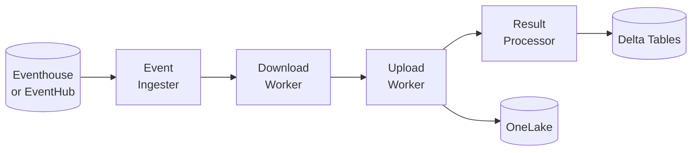
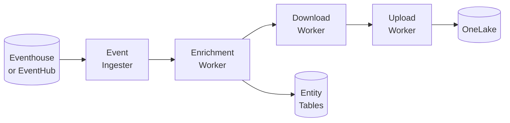
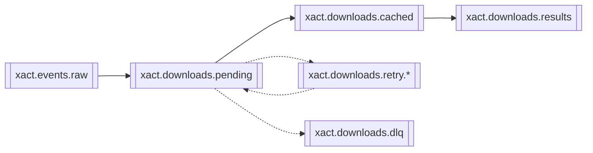
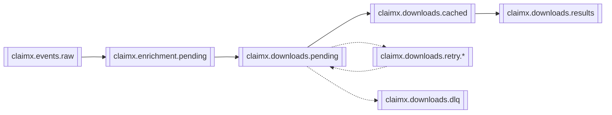

# Kafka Pipeline Overview

## What It Does

Downloads attachment files from external APIs and uploads them to OneLake (Microsoft Fabric). Supports two domains:
- **xact**: Transaction event processing with direct file downloads
- **claimx**: Claims event processing with API enrichment before downloads

## Domain Architecture

The pipeline is organized into two independent domains with separate workers and topics:

### xact Domain


### claimx Domain


| Domain | Components | Purpose |
|--------|------------|---------|
| **xact** | Event Ingester → Download → Upload → Result Processor | Direct file downloads from transaction events |
| **claimx** | Event Ingester → Enrichment → Download → Upload | API enrichment then media file downloads |

## Kafka Topics

Topics are namespaced by domain using prefixes (`xact.` or `claimx.`).

### xact Topics


| Topic | Purpose |
|-------|---------|
| `xact.events.raw` | Raw transaction events from Eventhouse/EventHub |
| `xact.downloads.pending` | Files waiting to be downloaded |
| `xact.downloads.cached` | Downloaded files waiting for upload |
| `xact.downloads.results` | Final status (success/failure) |
| `xact.downloads.retry.*` | Failed downloads awaiting retry (5m, 10m, 20m, 40m) |
| `xact.downloads.dlq` | Permanently failed downloads |

### claimx Topics


| Topic | Purpose |
|-------|---------|
| `claimx.events.raw` | Raw claims events from Eventhouse/EventHub |
| `claimx.enrichment.pending` | Events waiting for API enrichment |
| `claimx.downloads.pending` | Media files waiting to be downloaded |
| `claimx.downloads.cached` | Downloaded files waiting for upload |
| `claimx.downloads.results` | Final status (success/failure) |
| `claimx.downloads.retry.*` | Failed downloads awaiting retry (5m, 10m, 20m, 40m) |
| `claimx.downloads.dlq` | Permanently failed downloads |

### Topic Naming Convention

Topics follow the pattern: `{domain}.{workflow}.{stage}`

- **Domain**: `xact` or `claimx`
- **Workflow**: `events`, `enrichment`, `downloads`
- **Stage**: `raw`, `pending`, `cached`, `results`, `retry.*`, `dlq`

Configuration uses `get_topic(domain, topic_type)` helper to generate topic names.

## Key Files

### Common Infrastructure

| File | Purpose |
|------|---------|
| `__main__.py` | Entry point, starts workers for both domains |
| `common/eventhouse/poller.py` | Polls Eventhouse for events |
| `common/consumer.py`, `common/producer.py` | Base Kafka consumer/producer |
| `common/retry/`, `common/dlq/` | Retry and DLQ handling |

### xact Domain

| File | Purpose |
|------|---------|
| `xact/workers/event_ingester.py` | Processes transaction events, creates download tasks |
| `xact/workers/download_worker.py` | Downloads files from transaction events |
| `xact/workers/upload_worker.py` | Uploads downloaded files to OneLake |
| `xact/workers/result_processor.py` | Writes download results to Delta tables |
| `xact/schemas/` | Pydantic schemas for xact messages |
| `xact/writers/` | Delta Lake writers for xact tables |

### claimx Domain

| File | Purpose |
|------|---------|
| `claimx/workers/event_ingester.py` | Processes claims events, creates enrichment tasks |
| `claimx/workers/enrichment_worker.py` | Calls ClaimX API, writes entity data, creates download tasks |
| `claimx/workers/download_worker.py` | Downloads media files from presigned URLs |
| `claimx/workers/upload_worker.py` | Uploads downloaded files to OneLake |
| `claimx/handlers/` | Event handlers for different ClaimX event types |
| `claimx/api_client.py` | ClaimX API client with rate limiting |
| `claimx/schemas/` | Pydantic schemas for claimx messages |
| `claimx/writers/` | Delta Lake writers for entity and event tables |

## Running the Pipeline

### xact Workers

```bash
# Start all xact workers
python -m kafka_pipeline --worker all

# Start individual xact workers
python -m kafka_pipeline --worker xact-event-ingester
python -m kafka_pipeline --worker xact-download
python -m kafka_pipeline --worker xact-upload
python -m kafka_pipeline --worker xact-result-processor
```

### claimx Workers

```bash
# Start individual claimx workers
python -m kafka_pipeline --worker claimx-poller
python -m kafka_pipeline --worker claimx-ingester
python -m kafka_pipeline --worker claimx-enricher
python -m kafka_pipeline --worker claimx-downloader
python -m kafka_pipeline --worker claimx-uploader
```

### Common Options

```bash
# Run with metrics server on custom port
python -m kafka_pipeline --worker xact-download --metrics-port 9090

# Run in development mode (local Kafka only, no Event Hub/Eventhouse)
python -m kafka_pipeline --worker xact-download --dev

# Run with debug logging
python -m kafka_pipeline --worker claimx-enricher --log-level DEBUG

# Disable Delta Lake writes (for testing)
python -m kafka_pipeline --worker xact-result-processor --no-delta
```

## Configuration

### Core Settings (config.yaml or environment variables)

| Setting | Purpose | Example |
|---------|---------|---------|
| `EVENT_SOURCE` | Event source type | `eventhouse` or `eventhub` |
| `KAFKA_BOOTSTRAP_SERVERS` | Kafka broker addresses | `localhost:9092` |
| `KAFKA_XACT_TOPIC_PREFIX` | Topic prefix for xact domain | `xact` |
| `KAFKA_CLAIMX_TOPIC_PREFIX` | Topic prefix for claimx domain | `claimx` |

### Domain-Specific Paths

| Setting | Purpose | Example |
|---------|---------|---------|
| `ONELAKE_DOMAIN_PATHS__XACT` | OneLake path for xact files | `abfss://workspace@...` |
| `ONELAKE_DOMAIN_PATHS__CLAIMX` | OneLake path for claimx files | `abfss://workspace@...` |
| `DELTA_INVENTORY_TABLE_PATH` | xact attachments table | `Tables/xact_attachments` |
| `CLAIMX_EVENTS_TABLE_PATH` | claimx events table | `Tables/claimx_events` |

### ClaimX API Settings

| Setting | Purpose | Example |
|---------|---------|---------|
| `KAFKA_CLAIMX_API_URL` | ClaimX API base URL | `https://api.claimx.com` |
| `KAFKA_CLAIMX_API_USERNAME` | Basic auth username | `api_user` |
| `KAFKA_CLAIMX_API_PASSWORD` | Basic auth password | `***` |
| `KAFKA_CLAIMX_API_TIMEOUT_SECONDS` | Request timeout | `30` |
| `KAFKA_CLAIMX_API_MAX_RETRIES` | Max API retries | `3` |
| `KAFKA_CLAIMX_API_CONCURRENCY` | Max concurrent API requests | `10` |

### Worker Settings

| Setting | Purpose | Default |
|---------|---------|---------|
| `KAFKA_DOWNLOAD_CONCURRENCY` | Max concurrent downloads | `10` |
| `KAFKA_UPLOAD_CONCURRENCY` | Max concurrent uploads | `10` |
| `KAFKA_RETRY_DELAYS` | Retry delays in seconds | `[300, 600, 1200, 2400]` |
| `KAFKA_MAX_RETRIES` | Maximum retry attempts | `4` |

See `config.yaml` for complete configuration schema and examples.

## Error Handling

Both domains use the same retry and DLQ mechanisms:

- **Transient errors**: Retry with exponential backoff (5m → 10m → 20m → 40m)
- **Permanent errors**: Send to domain-specific DLQ (`{domain}.downloads.dlq`)
- **DLQ replay**: `python -m kafka_pipeline.common.dlq.cli replay <trace_id>`

## Observability

- **Metrics**: Prometheus metrics at `/metrics` (port 8000, configurable via `--metrics-port`)
- **Logging**: Structured JSON logs with trace context and domain tags
  - Set `JSON_LOGS=false` for human-readable logs during development
  - Logs written to `./logs/{worker_name}.log` (configurable via `--log-dir`)
  - Log levels: DEBUG, INFO, WARNING, ERROR (default: INFO)
