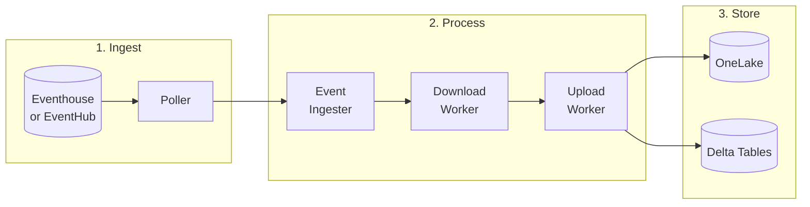
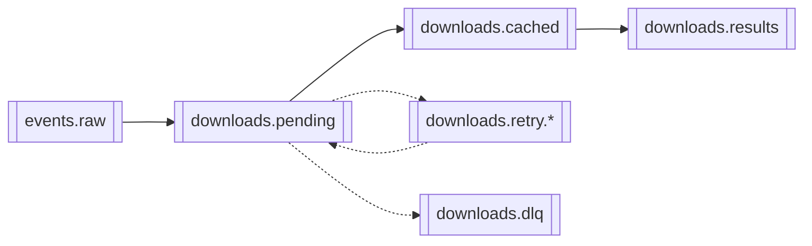

# Kafka Pipeline Overview

## What It Does

Downloads attachment files from external APIs and uploads them to OneLake (Microsoft Fabric).

## Pipeline Stages



| Stage | Component | What It Does |
|-------|-----------|--------------|
| **1. Ingest** | `KQLEventPoller` | Polls Eventhouse for new events via KQL queries |
| **2. Process** | `EventIngesterWorker` | Extracts attachment URLs from events |
| | `DownloadWorker` | Downloads files from URLs to local cache |
| | `UploadWorker` | Uploads cached files to OneLake |
| **3. Store** | `ResultProcessor` | Writes download results to Delta tables |

## Kafka Topics



| Topic | Purpose |
|-------|---------|
| `events.raw` | Raw events from Eventhouse/EventHub |
| `downloads.pending` | Files waiting to be downloaded |
| `downloads.cached` | Downloaded files waiting for upload |
| `downloads.results` | Final status (success/failure) |
| `downloads.retry.*` | Failed downloads awaiting retry (5m, 10m, 20m, 40m) |
| `downloads.dlq` | Permanently failed downloads |

## Key Files

| File | Purpose |
|------|---------|
| `__main__.py` | Entry point, starts workers |
| `eventhouse/poller.py` | Polls Eventhouse for events |
| `workers/event_ingester.py` | Processes events, creates download tasks |
| `workers/download_worker.py` | Downloads files |
| `workers/upload_worker.py` | Uploads to OneLake |
| `workers/result_processor.py` | Writes to Delta tables |

## Running the Pipeline

```bash
# Start all workers
python -m kafka_pipeline --worker all

# Start individual workers
python -m kafka_pipeline --worker event-ingester
python -m kafka_pipeline --worker download
python -m kafka_pipeline --worker upload
python -m kafka_pipeline --worker result-processor
```

## Configuration

Set via environment variables or `config.yaml`:

| Setting | Purpose |
|---------|---------|
| `EVENT_SOURCE` | `eventhouse` (polling) or `eventhub` (streaming) |
| `KAFKA_BOOTSTRAP_SERVERS` | Kafka broker addresses |
| `ONELAKE_*_PATH` | OneLake destination paths per domain |

## Error Handling

- **Transient errors**: Retry with exponential backoff (5m → 10m → 20m → 40m)
- **Permanent errors**: Send to DLQ for manual review
- **DLQ replay**: `python -m kafka_pipeline.dlq.cli replay <trace_id>`

## Observability

- **Metrics**: Prometheus metrics at `/metrics`
- **Dashboard**: `python -m kafka_pipeline.monitoring` (port 8080)
- **Logging**: Structured JSON logs with trace context
